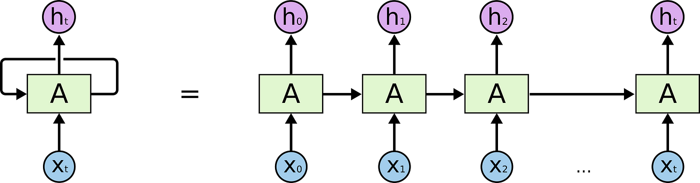
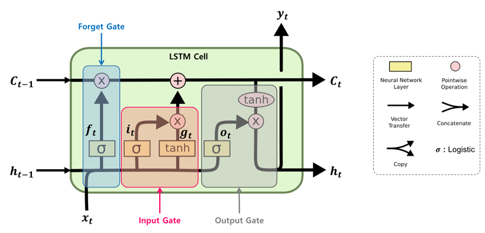

ViT 공부하려는데 기본이 없어서...

텍스트 벡터링 관련 공부하려고...

파이토치 트랜스포머를 활용한 자연어 처리와 컴퓨터비전 심층학습

이라는 책을 공부하는중임

---
```
2부 자연어 처리
    06. 임베딩
        언어모델
            자기회귀 언어 모델
            통계적 언어 모델
        N-gram
        TF-IDF
            단어 빈도
            문서 빈도
            역문서 빈도
            TF-IDF
        Word2Vec
            단어 벡터화
            CBoW
            Skip-gram
            계층적 소프트맥스
            네거티브 샘플링
            모델 실습: Skip-gram
            모델 실습: Gensim
        fastText
            모델 실습
        순환 신경망
            순환 신경망
            장단기 메모리
            모델 실습
        합성곱 신경망
            합성곱 계층
            활성화 맵
            풀링
            완전 연결 계층
            모델 실습
    07. 트랜스포머
        Transformer
            입력 임베딩과 위치 인코딩
            특수 토큰
            트랜스포머 인코더
            트랜스포머 디코더
            모델 실습
        GPT
            GPT-1
            GPT-2
            GPT-3
            GPT-3.5
            GPT-4
            모델 실습
```

이쪽 먼저 따로 떼서 공부할듯


---

### 텍스트 임베딩

텍스트를 기계에 바로 못넣으니 벡터로 만들어야함.

내 문장을 세상의 모든 단어와의 교집합 벡터로 만들면 거의 무한대의 0과 몇개의 1로 이루어진 너무 sparse한 벡터가 나옴

그래서 내 문장을 벡터 임베딩을 어떻게 할거냐! 가 관건인데 뭐 Word2Vec, fastText 등 이것저것 많음


여튼 여기까지 보다는 이 다음이 중요하니


&nbsp;
### 순환 신경망 (Recurrent Neural Network, RNN)

순서가 있는 연속 데이터를 처리하는데 적합함.

<div style="text-align: center;">
  <br>
  <span>RNN의 기본 구조</span>
</div>

각 셀은 이전 시점의 은닉 상태 $h_t$와 현재 시점의 데이터 $x_t$를 통해 현재 시점의 은닉 상태 $h_t$를 계산한다.

수식으로 나타내면 아래와 같다.


<div style="text-align: center;">
$ h_t = {\sigma}_h (h_{t-1} , x_t) $

$ h_t = {\sigma}_h (W_{hh} h_{t-1} + W_{xh} x_t + b_h) $

<span>순환 신경망의 은닉 상태</span>
</div>


${\sigma}_h$는 활성화 함수. ($W$는 가중치, $b$는 바이어스)

$W_{hh}$은 $h_{t-1}$에 대한 가중치.

$W_{xh}$는 입력값 $x_t$에 대한 가중치.

$b_h$는 은닉 상태 $h_t$의 바이어스.


출력값의 계산은 아래와 같다.

<div style="text-align: center;">
$ y_t = \sigma_y (h_t ) $

$ y_t = \sigma_y (W_{hy} h_t + b_y) $

<span>순환 신경망의 출력값</span>
</div>


셀을 여러개 활용하여 일대다, 다대일, 다대다 구조를 구현할 수 있다.

다대다 구조는 Seq2Seq 구조로 이루어지게 되는데, 고정된 벡터를 다루기 위해 입력 시퀀스를 처리하는 인코더와 출력 시퀀스를 생성하는 디코더로 구성되게 된다.

또한 문장 사이의 빈칸을 예측해야할 경우, 이후 시점의 출력도 가져오는 양방향 구조도 가능하며, 여러 층을 두어 층마다 다른 정보를 처리하는 다중 순환 신경망 구조도 가능하다.


&nbsp;
### 장단기 메모리 (Long Short-Term Memory, LSTM)

기존 RNN에서의 기억력 부족과 기울기 소실 문제를 해결하는 모델.

RNN은 시간적으로 먼 정보는 잘 기억하지 못함.

따라서 Memory Cell과 Gate 구조를 통해 장기 의존성 문제와 기울기 소실 문제를 해결함.


<div style="text-align: center;">
  <br>
  <span>LSTM의 기본 구조</span>
</div>


크게 Forget Gate, Input Gate, Output Gate로 구성됨.

- Forget Gate  
  Forget Gate는 이전 시점의 메모리 셀을 얼마나 유지할지 결정한다.
<div style="text-align: center;">
$ f_t = \sigma (W_x ^{(f)} x_t + W_h^{(f)} h_{t-1} + b^{(f)}) $
</div>


- Input Gate  
  Input Gate는 현재 시점의 새로운 정보를 얼마나 받아들일지 결정한다.
<div style="text-align: center;">
$ g_i = tanh(W_x^{(g)} x_t + W_x^{(g)} h_{t-1} + b^{(g)}) $

$ i_i = sigmoid(W_x ^{(i)} x_t + W_x ^{(i)} h_{t-1} + b^{(i)}) $
</div>


- Memory Cell 계산  
  Forget Gate와 Input Gate를 통해 현재 시점의 메모리 셀을 계산한다.
<div style="text-align: center;">
$ c_t = f_t * c_{t-1} + g_i * i_t $
</div>


- Output Gate  
  Output Gate는 메모리 셀을 통해 어떤 정보를 출력할지를 결정한다. (현재 시점의 은닉 상태 제어)
<div style="text-align: center;">
$ o_t = \sigma (W_x ^{(o)} x_t + W_h ^{(o)} h_{t-1} + b^{(i)} ) $
</div>


- 은닉 상태 갱신
<div style="text-align: center;">
$ h_t = o_t * tanh(c_t) $
</div>


