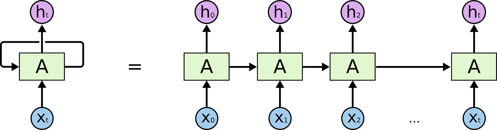

# 텍스트 임베딩 및 RNN, LSTM

ViT 공부하려는데 기본이 없어서...  일단 텍스트 벡터링 부터 공부하려고...

파이토치 트랜스포머를 활용한 자연어 처리와 컴퓨터비전 심층학습이라는 책을 공부하는중임

---

## 1. 텍스트 임베딩 개요

텍스트를 기계에 바로 못넣으니 벡터로 만들어야함.  
내 문장을 세상의 모든 단어와의 교집합 벡터로 만들면 거의 무한대의 0과 몇개의 1로 이루어진 너무 sparse한 벡터가 나옴  
그래서 내 문장을 벡터 임베딩을 어떻게 할거냐! 가 관건인데 뭐 Word2Vec, fastText 등 이것저것 많음

---

## 2. 순환 신경망 (Recurrent Neural Network, RNN)

순서가 있는 연속 데이터를 처리하는데 적합함.

   
  RNN의 기본 구조

### 2.1 은닉 상태 계산

각 셀은 이전 시점의 은닉 상태 $h_t$와 현재 시점의 데이터 $x_t$를 통해 현재 시점의 은닉 상태 $h_t$를 계산한다.

$ h_t = {\sigma}_h (h_{t-1} , x_t) $

$ h_t = {\sigma}_h (W_{hh} h_{t-1} + W_{xh} x_t + b_h) $

순환 신경망의 은닉 상태

- ${\sigma}_h$는 활성화 함수. ($W$는 가중치, $b$는 바이어스)
- $W_{hh}$은 $h_{t-1}$에 대한 가중치
- $W_{xh}$는 입력값 $x_t$에 대한 가중치
- $b_h$는 은닉 상태 $h_t$의 바이어스

### 2.2 출력값 계산

$ y_t = \sigma_y (h_t ) $

$ y_t = \sigma_y (W_{hy} h_t + b_y) $

순환 신경망의 출력값

### 2.3 구조 변형

셀을 여러개 활용하여 다양한 구조를 구현할 수 있다:

- **다대다 구조**: Seq2Seq 구조로 이루어지게 되는데, 고정된 벡터를 다루기 위해 입력 시퀀스를 처리하는 인코더와 출력 시퀀스를 생성하는 디코더로 구성
- **양방향 구조**: 문장 사이의 빈칸을 예측해야할 경우, 이후 시점의 출력도 가져오는 구조
- **다중 순환 신경망**: 여러 층을 두어 층마다 다른 정보를 처리하는 구조

---

## 3. 장단기 메모리 (Long Short-Term Memory, LSTM)

기존 RNN에서의 기억력 부족과 기울기 소실 문제를 해결하는 모델.  
RNN은 시간적으로 먼 정보는 잘 기억하지 못함.  
따라서 Memory Cell과 Gate 구조를 통해 장기 의존성 문제와 기울기 소실 문제를 해결함.

   
  LSTM의 기본 구조

### 3.1 Forget Gate

Forget Gate는 이전 시점의 메모리 셀을 얼마나 유지할지 결정한다.

$ f_t = \sigma (W_x ^{(f)} x_t + W_h^{(f)} h_{t-1} + b^{(f)}) $

### 3.2 Input Gate

Input Gate는 현재 시점의 새로운 정보를 얼마나 받아들일지 결정한다.

$ g_i = tanh(W_x^{(g)} x_t + W_x^{(g)} h_{t-1} + b^{(g)}) $

$ i_i = sigmoid(W_x ^{(i)} x_t + W_x ^{(i)} h_{t-1} + b^{(i)}) $

### 3.3 Memory Cell 계산

Forget Gate와 Input Gate를 통해 현재 시점의 메모리 셀을 계산한다.

$ c_t = f_t * c_{t-1} + g_i * i_t $

### 3.4 Output Gate

Output Gate는 메모리 셀을 통해 어떤 정보를 출력할지를 결정한다. (현재 시점의 은닉 상태 제어)

$ o_t = \sigma (W_x ^{(o)} x_t + W_h ^{(o)} h_{t-1} + b^{(i)} ) $

### 3.5 은닉 상태 갱신

$ h_t = o_t * tanh(c_t) $

---

## 🔗 Reference

- 파이토치 트랜스포머를 활용한 자연어 처리와 컴퓨터비전 심층학습