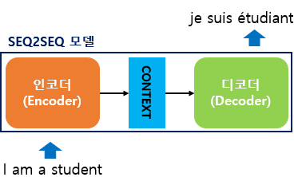
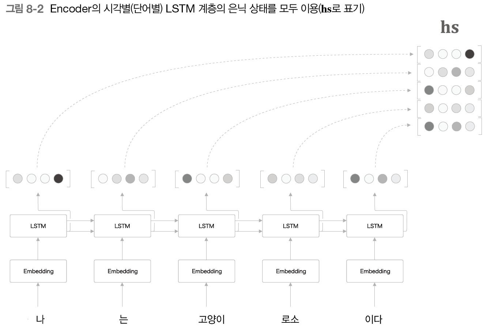
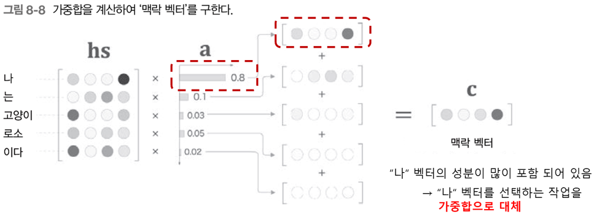
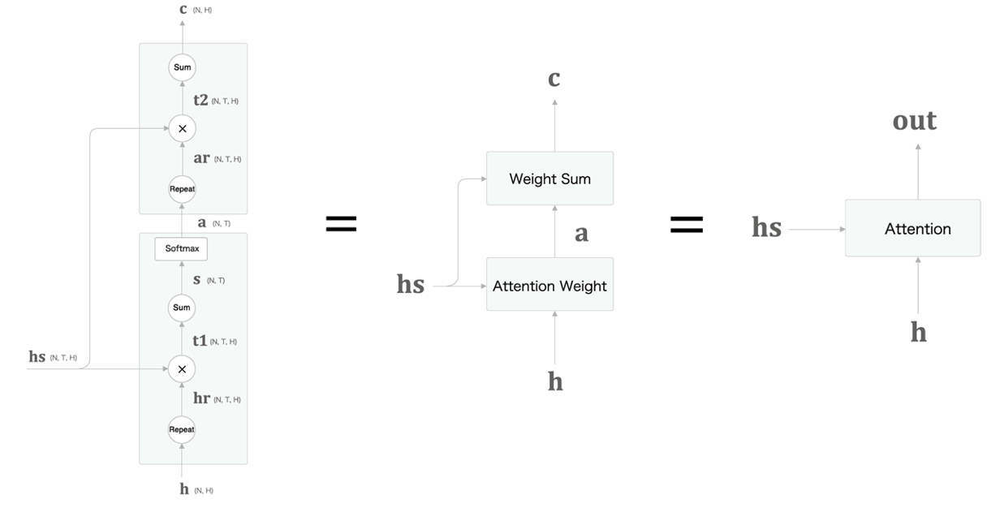
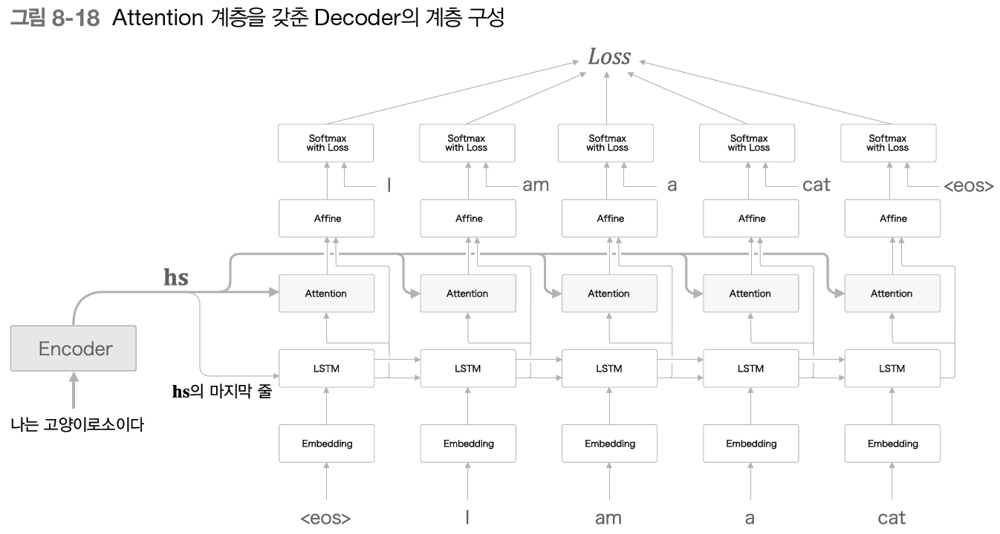

# 1. Seq2Seq와 Attention

RNN을 이용해 시계열을 다루다 보면 장기 의존성 문제를 해결하려고 LSTM을 사용하게 됨.  
이 흐름을 발전시켜 **입력 시퀀스를 출력 시퀀스로 변환**하는 대표적인 구조가 **Seq2Seq(Sequence-to-Sequence)** 모델임.  
대표적인 예로 번역기가 있다.

---

## 1.1. Seq2Seq 기본 구조

1. **Seq2Seq**는 인코더-디코더 구조를 갖는다.
    - 입력 시퀀스를 고정된 길이 벡터로 요약(context vector)  
    - context vector를 바탕으로 출력 시퀀스 생성

    

       
    

2. **인코더**
    - 입력 시퀀스를 순차적으로 처리
    - 마지막 hidden state를 **context vector**로 출력

3. **디코더**
    - context vector를 입력받아 하나씩 토큰을 예측하며 시퀀스 생성

4. **동작 흐름**
    - 인코더의 마지막 hidden state → 디코더의 초기 hidden state로 전달
    - 디코더의 첫 입력은 special token `<sos>`
    - 이후 디코더의 출력이 다음 입력으로 사용되며, `<eos>`가 나올 때까지 반복

    

       
    

---

## 1.2. Teacher Forcing

- 학습 시에는 디코더가 예측한 결과 대신 **실제 정답(ground truth)**을 다음 입력으로 넣어 학습  
- **Teacher Forcing**:  
    - 장점: 학습 안정화, 빠른 수렴  
    - 단점: 테스트(실전)에서는 정답을 알 수 없으므로 오류가 누적될 수 있음  
- 이 문제를 완화하기 위해 **scheduled sampling**(teacher forcing 비율 조절) 기법이 등장

---

## 1.3. Attention 메커니즘

Seq2Seq의 한계  
  - context vector 하나에 모든 정보가 압축되면서 정보 손실 발생  
  - LSTM이라도 긴 시퀀스에서는 기울기 소실 문제가 존재

이 한계를 해결하기 위해 **Attention** 도입

   

### 1.3.1. Attention 원리

- 인코더의 모든 hidden state들을 저장  
- 디코더가 각 시점마다 **어느 부분에 집중(attend)** 할지 가중치를 계산

   

#### 수식 흐름 (Dot-product Attention 기준)

1. **score 계산 (내적)**  
    $ score(s_i, t) = h_s^{(i)^\top} h_t $

2. **attention weight(softmax 정규화)**  
    $ \alpha_i = \frac{\exp(score(s_i, t))}{\sum_j \exp(score(s_j, t))} $

3. **context vector 계산(가중합)**  
    $ c_t = \sum_i \alpha_i h_s^{(i)} $

- 구한 $ c_t $는 디코더 해당 시점의 출력 계산에 사용됨

   

---

### 1.3.2. Attention Decoder 구조

- 디코더가 각 시점마다 context vector를 새로 계산해 정보 손실 최소화  
- 더 섬세한 시퀀스 변환 가능

   

---

## 1.4. 정리

- Seq2Seq는 인코더-디코더 구조로, 입력 시퀀스를 context vector로 요약해 출력 시퀀스를 생성
- Attention 메커니즘은 각 시점마다 입력 시퀀스의 중요 부분을 동적으로 참조하여, 정보 손실과 기울기 소실 문제를 해결  
- 이 구조는 이후 **Transformer**의 핵심으로 발전

---

## 🔗 Reference

- https://wikidocs.net/22893
- 밑바닥부터 시작하는 딥러닝 2
