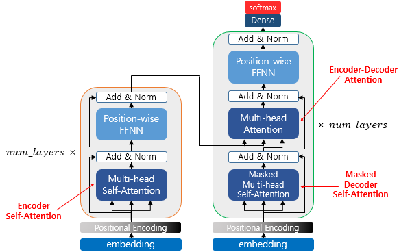

## Transformer

트랜스포머는 2017년 "Attention is all you need"을 근본으로 한다.

기존 seq2seq의 구조인 인코더-디코더 구조이지만, attention 만으로 구현한 모델이다.

&nbsp;
### 1. 기존 seq2seq의 한계

seq2seq에서는 context vector로 압축하면서 정보 손실이 있었음.

그래서 RNN의 보정을 위해 어텐션이 활용되었는데, 어텐션만으로 인코더와 디코더를 만들자는 아이디어.

&nbsp;
### 2. Transformer's hyper-parameter

$ d_{model} = 512 $ : embedding vector의 크기 (인코더, 디코더 사이에서도 차원 유지)

$ \texttt{num_layers} = 6 $ : 인코더, 디코더 각각의 층 수

$ \texttt{num_heads} = 8 $ : 병렬로 수행할 어텐션의 수

$ d_{ff} = 2048 $ : transformer 내부 feed-forward 네트워크의 hidden-layer 크기.

&nbsp;
### 3. Transformer's structure

   

transformer는 위와 같이 시점별로 분리된 단위가 아닌, 인코더와 디코더들이 각각 층으로 분리된 구조를 가짐.

&nbsp;
### 4. Positional Encoding

RNN은 단어를 순차적으로 입력받아, 그 자체가 위치 정보였음.

하지만 transformer는 단어 순서를 입력받는 순차 구조가 없어서, 위치 정보를 별도로 인코딩 해서 입력에 더해줘야함.

   

positional encoding 값은 아래 두개의 함수를 통해 만들어짐.

$ PE_{(pos,2i)} = sin (pos/10000^{2i/d_{model}}) $

$ PE_{(pos,2i+1)} = cos(pos/10000^{2i/d_{model}}) $

sin/cos가 주기함수라서 상대적인 위치정보 표현에 유리해서 저렇게 했다고 함.

   

   
  50x128 예시 (50단어, 각 단어가 128차원)

&nbsp;
### 5. Attention

transformer에는 3가지 attention이 활용됨.

   

Self-Attention : Query, Key, Value가 동일한 경우

Encoder-Decoder Attention : Query가 디코더의 벡터, Key, Value는 인코더의 벡터

(Note. Q, K, V 등이 같다는 것은 값이 아니라 출처가 같다는 것)

   
  transformer의 전체 구조 및 세가지 어텐션의 출처

&nbsp;
### 7. Encoder's Self-Attention

일단 Q, K, V 부터 얻어야함.

이전에 seq2seq에서 어텐션을 활용할 경우

Query : 특정 시점 디코더의 출력

Key : 모든 시점의 인코더 셀의 은닉 상태들

Value : 모든 시점의 인코더 셀의 은닉 상태들

트랜스포머에서 어텐션을 활용할 경우

Query : 입력 문장의 모든 단어 벡터들

Key : 입력 문장의 모든 단어 벡터들

Value : 입력 문장의 모든 단어 벡터들

   

2) Q, K, V 벡터 얻기

   

3) Scaled dot-product Attention

그냥 내적(Q, K)은 Attention score,

Attention score을 softmax 하면 Attention weight (Distribution)

$ \sqrt{d_k} $를 왜하냐?는 Q, K의 dot-product가 차원이 커질 수록 값이 커져버려서 softmax가 saturate되는 문제를 방지하기 위함.

Attention weight를 V와 가중합 하여 Attention Value 획득

   

   

4) 행렬 연산으로 일괄 처리하기

   

   

   

수식으로 정리하면,

$ Attention(Q, K, V) = softmax ( \frac{ QK^T}  {\sqrt{d_k}} )V $

5) Multi-head Attention

   

각 head에서 나온 attention 결과를 concat 한 뒤, (concatenated matrix)

$W^O$ (weight)로 projection하여 원래 모델 차원인 $d_{model}$로 맞춰줌.

   

   
  Multi-head attention matrix의 사이즈는 $ (\texttt{seq_len}, d_{model}) $

&nbsp;
### 8. Position-wise FFNN

FFNN은 인코더, 디코더 모두 가지고 있는 서브 층 (단어 각각 실행해서 position-wise)

attention이 "어디를 볼지"를 알려준다면, FFNN은 "봐서 뭘 느꼈는지"를 알아냄

attention은 선형 조합만 할 뿐, 비선형적인 변환이 어렵기 때문.

   

   
  $ FFNN(x) = MAX(0, xW_1 + b_1 ) W_2 + b_2 $

### 9. From Encoder To Decoder

### 10. Decoder의 첫번째 서브층 : self-attention, look-ahead mask

넘어오는 context vector는 병렬로 한번에 넘어오는데, 병렬로 학습하면 앞과 뒤를 모두 보고 학습하게 됨.

하지만 학습 이후 inference에서는 앞만 보고 뒤를 생성해야 해서, 성능이 잘 안나옴.

따라서 학습 과정에서도 앞만 보게 마스킹을 해줌.

"즉, decoder가 미래 단어를 보지 못하도록 해서 '앞 단어만 보고 다음 단어를 예측'하게 만드는 것이 핵심."

   

   

### 11. Decoder의 두번째 서브층 : Encoder-Decoder attention

디코더의 첫번째 서브층은 디코더 스스로의 Self-Attention.

디코더의 두번째 서브층은 인코더와 디코더의 Cross-Attention. (K, V가 인코더꺼)

디코더가 지금까지 (self-attention으로) 생성한 문장을 가지고,

입력 문장에서 어떤 정보를 참고해야하는지 판단하는 용도.
---

Reference : https://wikidocs.net/31379

