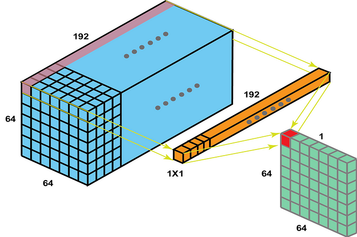

# 컴퓨터 비전 - 분류 모델

컴퓨터 비전 분야에서 이미지 분류는 가장 기본적이면서도 중요한 태스크임.  
2012년 AlexNet의 등장 이후, 딥러닝 기반의 비전 모델들은 놀라운 속도로 발전해옴.  

---

## 1. 초기 CNN 혁신 (2012-2014)

---

### 1.1 AlexNet (2012)

   
  AlexNet의 구조

- **주요 특징**
  - ReLU 활성화 함수 도입
  - Dropout으로 과적합 방지
  - 큰 합성곱 필터(11x11, 5x5) 사용
  - GPU 병렬 연산 활용
  - CNN 붐의 시작점, 딥러닝의 대중화

- **한계점**
  - 큰 합성곱 필터로 파라미터 수 과다
  - 적은 층 수로 인해 고수준 특징 학습 어려움
  - 계산 비용이 높음

---

### 1.2 VGG (Visual Geometry Group, 2014)

   
  VGG의 구조

- **주요 특징**
  - 3x3 conv 반복으로 구조 단순화
  - 네트워크 깊이 증가
  - 작은 필터 크기로 파라미터 수 감소

- **한계점**
  - 깊은 네트워크에서 gradient 소실 문제 발생
  - 파라미터 수가 여전히 많음

#### 1.2.1 3x3 Convolution

- **구조**
  - 작은 필터 크기(3x3)의 반복적 사용
  - 5x5 conv를 3x3 conv 두 개로 대체
  - ReLU 활성화 함수 사용

- **작동 방식**
  - 작은 필터로도 큰 수용 영역 커버 가능
  - 파라미터 수 감소로 학습 효율성 향상
  - 깊은 네트워크에서 특징 추출 능력 향상

---

## 2. 네트워크 구조 혁신 (2014-2018)

---

### 2.1 GoogLeNet (Google + LeNet, 2014)

   
  GoogLeNet의 전체 구조

- **주요 특징**
  - 22층의 깊은 네트워크
  - Inception 모듈의 병렬 구조로 다양한 스케일의 특징 동시 추출
  - 1x1 conv를 통한 파라미터 효율성 극대화
  - Auxiliary classifier로 gradient flow 개선

- **한계점**
  - Auxiliary classifier의 추가적인 계산 비용
  - 병렬 구조로 인한 메모리 사용량 증가
  - 네트워크 구조가 복잡해 구현과 디버깅이 어려움

#### 2.1.1 Inception 모듈

   
  Inception 모듈의 구조

- **구조**
  - 다양한 크기의 커널(1x1, 3x3, 5x5) 동시 적용
  - Max pooling 레이어 포함
  - 병렬 구조로 다양한 특징 추출

#### 2.1.2 1x1 Convolution

   
  1x1 Convolution의 역할

- **구조**
  - 차원 축소로 파라미터 수 감소
  - 비선형성 추가 (ReLU와 함께 사용)
  - 계산 효율성 향상
  - 28x28x192 -> 28x28x32 를 5x5x32 conv 하는것 보다 1x1x16, 5x5x32 conv 하는게 10배 이상 파라미터 다이어트

#### 2.1.3 Auxiliary Classifier

   
  Auxiliary Classifier의 구조와 작동 방식

- **구조**
  - 네트워크 중간(Inception 4a, 4d)에 2개의 auxiliary classifier 배치
  - 각 classifier는 average pooling, 1x1 conv, fc layer, softmax로 구성
  - 최종 loss는 main classifier와 2개의 auxiliary classifier의 가중합

- **작동 방식**
  - 중간 layer에서도 softmax를 통해 예측 수행
  - 각 classifier의 loss가 backpropagation에 기여하여 gradient 소실 문제 해결
  - 학습 시에만 사용되고, 추론 시에는 제거됨

---

### 2.2 ResNet (2015)

   
  ResNet의 전체 구조

- **주요 특징**
  - 최대 152층의 매우 깊은 네트워크
  - Residual Block의 반복적 사용
  - Skip Connection으로 gradient flow 개선
  - Residual learning으로 깊은 네트워크 학습 가능

- **한계점**
  - Feature reuse가 제한적
  - 파라미터 효율성이 낮음

#### 2.2.1 Residual Block과 Skip Connection

   
  Residual Block의 구조

- **구조**
  - Skip Connection으로 입력과 출력 직접 결합
  - 입력은 그대로 통과시키고, conv layer는 residual만 학습

- **Bottleneck 구조**
  - 1x1 conv로 차원 축소 -> 3x3 conv -> 1x1 conv로 차원 확장
  - 3x3 conv의 연산량을 줄여 파라미터 수 감소
  - ResNet-50, 101, 152에서 사용

- **작동 방식**
  - F(x) = H(x) - x로 residual learning 수행
  - Skip Connection으로 gradient가 직접 전달되어 vanishing gradient 문제 해결
  - Identity mapping으로 정보 보존

---

### 2.3 DenseNet (2017)

   
  DenseNet의 구조

- **핵심 아이디어**
  - 모든 이전 layer의 feature map을 현재 layer의 입력으로 사용
  - Feature reuse 극대화로 파라미터 효율성 향상
  - ResNet 대비 50% 적은 파라미터로 유사한 성능

- **주요 특징**
  - Dense Block: 모든 layer가 이전 layer들과 직접 연결
  - Transition Layer: Dense Block 사이에서 feature map 크기 조정
  - Growth Rate: 각 layer가 생성하는 feature map 수 제어
  - **Implicit Deep Supervision**: gradient가 모든 layer로 직접 전달됨
  - **Concat 기반 정보 보존**: ResNet의 더하기 방식보다 더 풍부한 feature 유지

- **장단점**
  - 장점: 파라미터 효율성, gradient flow 개선
  - 단점: 메모리 사용량 증가, 실시간 추론 제약

---

### 2.4 MobileNet V1 (2017)

   

- **핵심 아이디어**
  - 모바일/임베디드 환경을 위한 경량화 CNN
  - 일반 convolution을 두 단계로 분리하여 연산량 감소
  - 모델 크기와 정확도의 trade-off를 위한 하이퍼파라미터 도입

- **주요 특징**
  - **Depthwise Separable Convolution**
    - 1단계 - Depthwise Conv: 각 입력 채널별로 독립적인 spatial convolution 수행
    - 2단계 - Pointwise Conv: 1x1 convolution으로 채널 간 정보 결합
    - 예시) 입력 채널이 3개일 때:
      - 일반 Conv: 3x3x3 필터로 한 번에 연산
      - Depthwise Separable Conv: 3x3 필터 3개로 각각 연산 후, 1x1 conv로 결합
  - **Width Multiplier (α)**
    - 네트워크의 전체적인 구조는 유지하면서 얇게 만드는 옵션
    - 각 layer의 입/출력 채널 수를 α배로 조절 (α ≤ 1.0)
    - α가 작을수록 더 가벼운 모델 (α = 1, 0.75, 0.5, 0.25)

- **장단점**
  - 장점:
    - 일반 convolution 대비 8-9배 적은 연산량
    - 모바일 환경에서 실시간 추론 가능
  - 단점:
    - 정확도가 일반 CNN보다 다소 낮음
    - 채널 간 정보 교환이 제한적

---

### 2.5 MobileNet V2 (2018)

   
  MobileNet V2의 Inverted Residual Block

- **핵심 아이디어**
  - 채널 수가 너무 작으면 처리할 정보가 부족하니, 1x1 Conv로 채널을 rich하게 만들어서 depthwise를 하자 !
  - Inverted Residual Block 도입
  - Linear Bottleneck으로 정보 손실 최소화
  - V1의 한계점 개선

- **주요 특징**
  - **Inverted Residual Block**
    - 1x1 Conv로 채널 수 확장 (expansion)
    - Depthwise Conv로 공간적 특징 추출
    - 1x1 Conv로 채널 수 감소 (projection)
  - **Linear Bottleneck**
    - 저차원에서의 정보 손실 방지
  - **Expansion Ratio**
    - 채널 확장 비율을 하이퍼파라미터로 조절
    - 기본값은 6 (입력 채널의 6배로 확장)

- **장단점**
  - 장점:
    - V1 대비 정확도 향상
    - 더 깊은 네트워크 학습 가능
    - 메모리 접근 최적화
  - 단점:
    - Expansion으로 인한 중간 연산량 증가
    - 큰 expansion ratio에서 메모리 사용량 증가

---

## 3. 자동화와 최적화 (2018-2019)

---

### 3.1 NAS (Neural Architecture Search)

- **개요**: 최적의 신경망 구조를 자동으로 탐색하는 방법론. 주로 강화 학습을 이용하여 다양한 구조를 생성하고 평가하여 최적의 아키텍처를 탐색.
- **주요 특징**: 사람이 직접 설계하는 것보다 더 효율적인 구조를 발견할 수 있지만, 탐색 과정에 매우 많은 계산 자원이 필요.

---

### 3.2 EfficientNet (2019)

- **개요**: NAS를 통해 최적화된 기본 모델(EfficientNet-B0)을 찾고, 네트워크의 깊이(depth), 너비(width), 입력 해상도(resolution)를 균형 있게 확장하는 'Compound Scaling' 방법을 제안하여 높은 성능과 효율성을 달성한 모델.
- **주요 특징**: 적은 파라미터로 높은 정확도를 보여주며, 모델 크기와 성능 간의 좋은 트레이드오프를 제공.

---

## 4. Transformer의 등장 (2020)

---

### 4.1 Vision Transformer (ViT)

   
  Vision Transformer의 기본 구조

- **주요 특징**
  - CNN 없이 Transformer만으로 이미지 분류
  - 이미지를 패치로 분할하여 시퀀스로 처리
  - Positional embedding으로 위치 정보 보존

- **기술적 의의**
  - 비전 분야에 Transformer 도입
  - 새로운 패러다임 제시

> Note: Vision Transformer는 그 중요성과 복잡성으로 인해 별도의 포스트에서 자세히 다룰 예정입니다.

---

## 5. 정리

---

- CNN 기반 모델들의 발전은 네트워크 구조의 혁신을 통해 이루어짐
- 각 모델은 이전 모델의 한계를 해결하면서 발전
- 최근에는 효율성과 해석 가능성이 중요시됨
- Transformer 기반의 ViT는 별도 페이지에 정리하고자 함

---

## 🔗 Reference

- 각 모델의 원 논문
- 이미지 처리 바이블
- https://ys-cs17.tistory.com/3
- https://day-to-day.tistory.com/64
- https://viso.ai/deep-learning/googlenet-explained-the-inception-model-that-won-imagenet/
- Dive into Deep Learning
