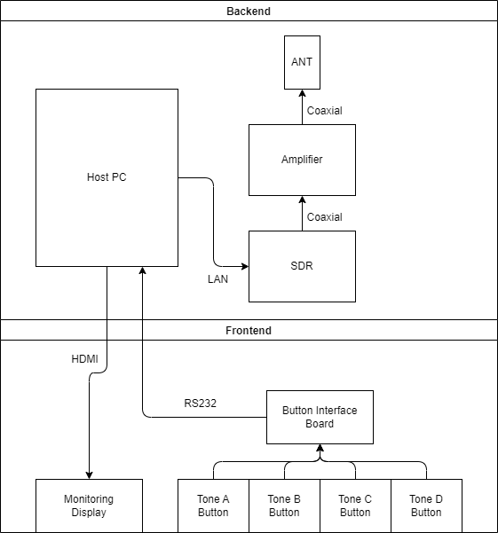
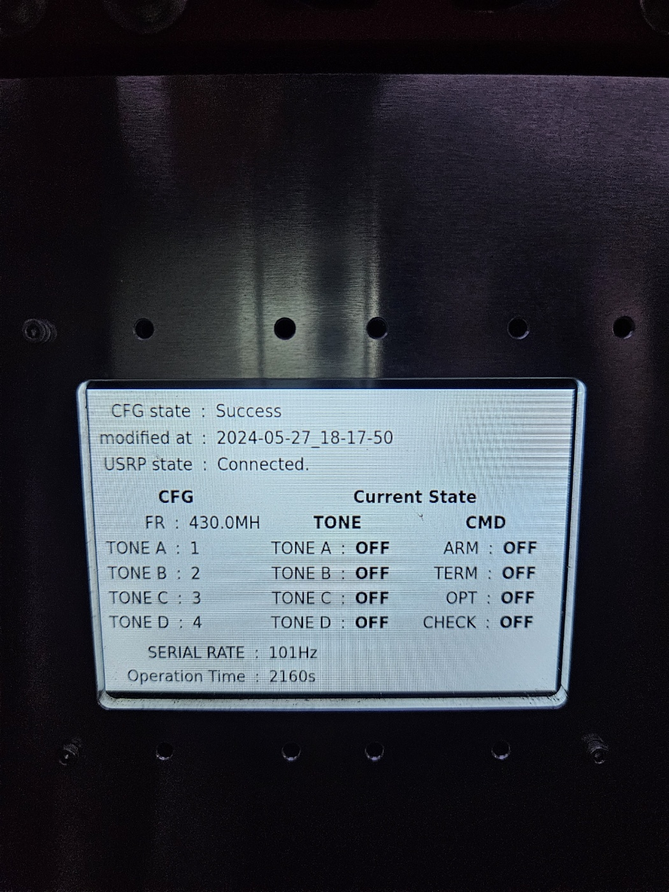

## Introduction
In this post, I will share the development process of an SDR-based Flight Termination System (FTS) transmitter, which was implemented as part of a launch vehicle project.

The aim was to create a reliable, cost-effective, and redundant transmitter using COTS (commercial off-the-shelf) components and standard IRIG tones.

&nbsp;

## 1. Background

   
  Reference

The Flight Termination System (FTS) is a safety-critical system that transmits termination commands to a launch vehicle in case of emergency, to protect lives and property.

This project focused on implementing a Manual FTS (MFTS) using standard IRIG tones and FM modulation.

Key Concepts:
- Standard IRIG Tone: A command system combining specific frequency tones to create valid FTS commands.
- SDR (Software Defined Radio): Enables flexible, programmable RF signal generation.

&nbsp;

## 2. System Architecture

   
  System Architecture

The FTS transmitter consists of:

- Host PC: Generates IRIG tone signals and provides a user interface.
- SDR Transmitter: Converts the signal to RF and transmits via antenna.
- Button Interface Board: Dedicated hardware (FPGA-based) for safe, reliable command input.
- Monitoring Display: Shows system status and configuration.

&nbsp;

## 3. Key Requirements

- Generation of all standard IRIG tones.
- Ready for use within 1 minute after power-on.
- USB-based mission configuration file loading (no manual config changes).
- Four physical buttons for tone assignment.
- Real-time status display (operation mode, frequency, tone assignment, transmission state).
- Easy integration with power amplifier and FTR for system testing.

&nbsp;

## 4. Implementation

### 4.1. Button Interface Board
Features:
- Reliable state transmission via RS232.
- Error detection via checksum.
- Verilog HDL implementation, with simulation using Modelsim.

   
  FPGA board

   
  RTL view

&nbsp;

### 4.2. Signal Generation & SDR Integration

   
  Signal Generation & SDR Integration

Software:

- Signal processing designed using GNU Radio.
- Custom code for configuration parsing and button interface integration.
- Real-time update of command state via serial threading.

Signal Flow:

- Multiple sine wave sources for IRIG tones.
- Combined and FM modulated before being sent to the SDR transmitter.
- Parameter tuning for amplitude, frequency deviation, etc.

&nbsp;

### 4.3. Monitoring Display

The monitoring display was built using PyQt and shows all key system information at a glance—like operation status, current frequency, tone assignments, and transmission state.

It made it super easy to check if everything was working as expected during tests.

   
  Monitoring Display

&nbsp;

## 5. Testing & Verification

   
  Testing & Verification

Subsystem Validation: Long-duration stability tests for button board and SDR core.

System Integration: Verified command recognition, config parsing, signal integrity.

Field Test: Confirmed system reliability under operational conditions.

&nbsp;

## 6. Conclusion
Unfortunately, our receiver only supported 11 IRIG tones, so not every possible case was tested.

However, we were able to fully verify all required performance targets with the available tones—such as reliable signal transmission, command recognition, and real-time status monitoring.

The system performed stably during both lab and field tests, and overall, it met all project goals within the intended scope.

